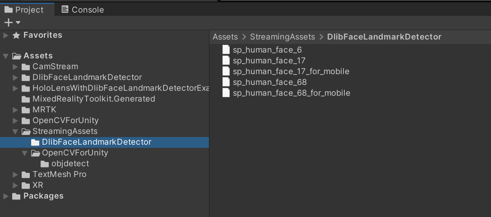
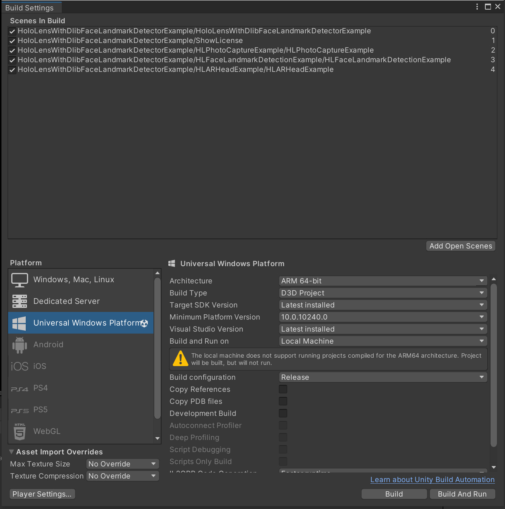
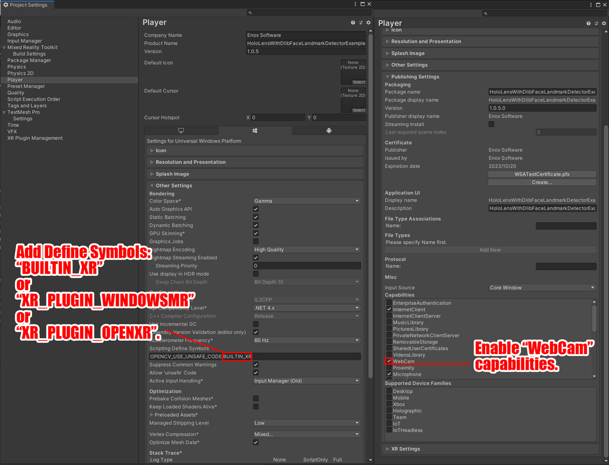

# HoloLens With DlibFaceLandmarkDetector Example

## What's new
* MRTKv2 support.

## Demo Video (old version)

## Demo Hololens App
* [HoloLensWithDlibFaceLandmarkDetectorExample.zip](https://github.com/EnoxSoftware/HoloLensWithDlibFaceLandmarkDetectorExample/releases)
* Use the Windows Device Portal to install apps on HoloLens. [https://docs.microsoft.com/en-us/hololens/hololens-install-apps](https://docs.microsoft.com/en-us/hololens/hololens-install-apps)

## Environment
* Hololens 10.0.17763.914 (RS5)
* Windows 10 SDK 10.0.18362.0
* Visual Studio 2017 or 2019
* Unity 2018.4+  
* [Microsoft Mixed Reality Toolkit](https://github.com/Microsoft/MixedRealityToolkit-Unity/releases) v2.2.0 
* [OpenCV for Unity](https://assetstore.unity.com/packages/tools/integration/opencv-for-unity-21088?aid=1011l4ehR) 2.3.7+ 
* [Dlib FaceLandmarkDetector](https://assetstore.unity.com/packages/tools/integration/dlib-facelandmark-detector-64314?aid=1011l4ehR) 1.2.9+ 
* [HoloLensCameraStream](https://github.com/VulcanTechnologies/HoloLensCameraStream)  

## Setup
1. Download the latest release unitypackage. [HoloLensWithDlibFaceLandmarkDetectorExample.unitypackage](https://github.com/EnoxSoftware/HoloLensWithDlibFaceLandmarkDetectorExample/releases)
1. Create a new project. (HoloLensWithDlibFaceLandmarkDetectorExample)
1. Import the OpenCVForUnity.
    * Setup the OpenCVForUnity. (Tools > OpenCV for Unity > Set Plugin Import Settings)
    * Move the "OpenCVForUnity/StreamingAssets/haarcascade_frontalface_alt.xml" and "OpenCVForUnity/StreamingAssets/lbpcascade_frontalface.xml" to the "Assets/StreamingAssets/" folder.
1. Import the DlibFaceLandmarkDetector.
    * Setup the OpenCVForUnity. (Tools > Dlib FaceLandmarkDetector > Set Plugin Import Settings)
    * Move the "DlibFaceLandmarkDetector/StreamingAssets/sp_human_face_68.dat", "sp_human_face_68_for_mobile.dat", "sp_human_face_17.dat", "sp_human_face_17_for_mobile.dat" and "sp_human_face_6.dat" to the "Assets/StreamingAssets/" folder. 
1. Clone HoloLensCameraStream repository.
    * Copy the "HoloLensCameraStream/HoloLensVideoCaptureExample/Assets/CamStream/" folder to the "Assets/" folder.
    * Set the scripting backend of the plugin inspector to "Any Script Backend". (IL2CPP support)
1. Import the Microsoft.MixedReality.Toolkit.Unity.Foundation.2.2.0.unitypackage.
    * Setup the MRTKv2. (Mixed Reality ToolKit > Utilities > Configure Unity Project)
1. Import the HoloLensWithDlibFaceLandmarkDetectorExample.unitypackage.
1. Add the "Assets/HoloLensWithDlibFaceLandmarkDetectorExample/*.unity" files to the "Scenes In Build" list in the "Build Settings" window.
1. Build and Deploy to HoloLens. (See [https://developer.microsoft.com/en-us/windows/holographic/holograms_100](https://developer.microsoft.com/en-us/windows/holographic/holograms_100))

|Project Assets|MRTK Project Configurator|
|---|---|
|||

|Build Settings|Player Settings|
|---|---|
|||

## ScreenShot (old version)
 

 

 

